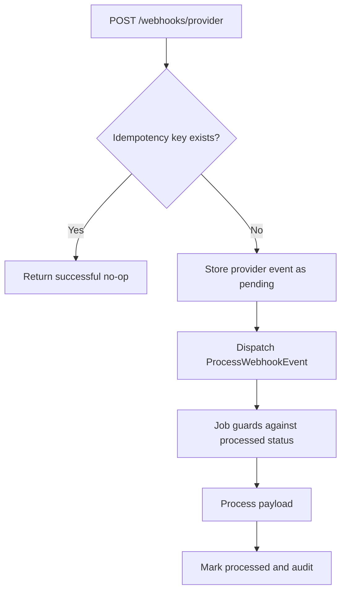

# ADR 004: Idempotent webhook ingestion with a provider_events table

## Status

Accepted

## Context

LedgerFlow receives webhook events from external payment providers. Providers may deliver the same event multiple times, and duplicate processing could double-count financial activity.

## Decision

Store incoming webhook events with a unique idempotency key and enforce idempotency in both the HTTP boundary and the queued job.

## Processing flow

## Consequences

- Provider event storage grows over time and needs a pruning strategy.
- Each provider needs provider-specific signature validation.
