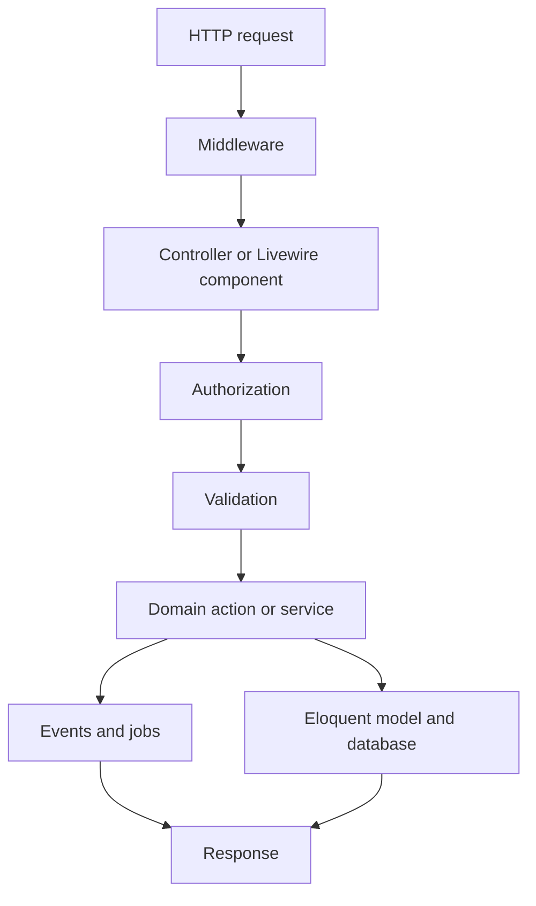
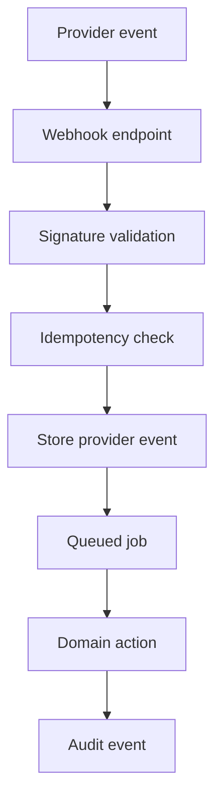
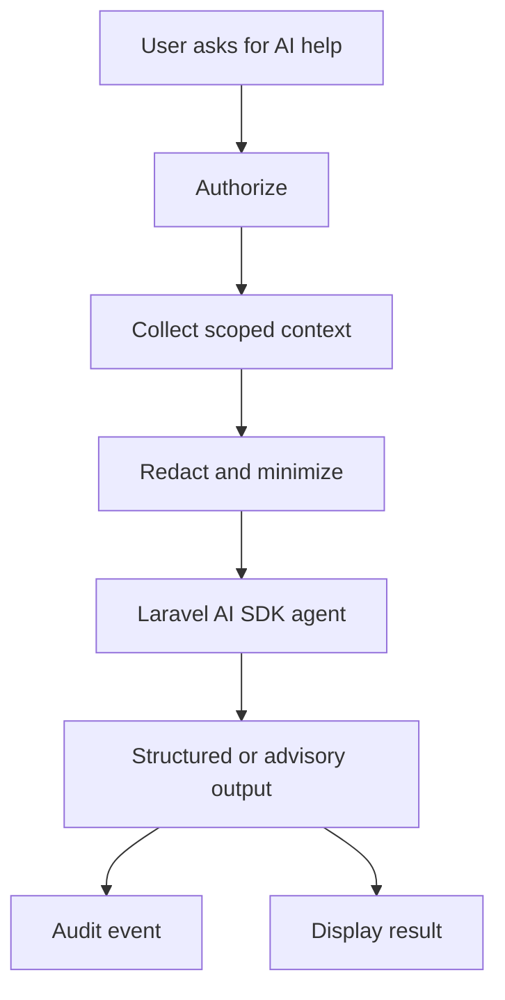

# Architecture

LedgerFlow is a modular Laravel monolith. It uses Laravel's batteries-included runtime while keeping domain boundaries explicit through actions, policies, jobs, and events.

## Why modular monolith

This keeps the system easy to run, test, and deploy while preserving transactional consistency for financial workflows. Service extraction should only happen when a boundary has independent scale, ownership, or deployment needs.

## Main domains

- Identity and authentication
- Organizations and membership
- Accounts and transactions
- Reconciliation
- Payment provider webhooks
- Audit logging
- AI analysis
- Operations and observability

## Request flow

## External event flow

## AI flow

## Boundary rules

- Controllers, Livewire components, jobs, and commands should be thin.
- Domain actions own state-changing workflows.
- Policies own access decisions.
- Jobs own asynchronous retries and failure handling.
- Audit events describe meaningful business and operational activity.
