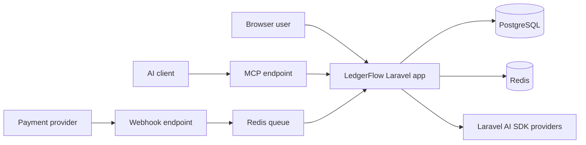

# LedgerFlow

LedgerFlow is a modular Laravel fintech platform for multi-tenant financial ledgers, AI-assisted analysis, idempotent webhook ingestion, reconciliation workflows, and read-only MCP access for AI clients.

## What this documentation covers

- **Setup**: how to run LedgerFlow locally with Sail and the required supporting services.
- **Operations**: queues, webhooks, CI, release automation, and documentation publishing.
- **Domain Model**: the main data ownership boundaries and financial consistency rules.
- **AI Strategy**: how Laravel AI SDK features are scoped, audited, and tested.
- **Architecture**: the modular monolith structure and the request/event flows.
- **ADRs**: accepted decisions that should shape future implementation work.

## System context

## Engineering principles

- Validate and authorize at the boundary, then delegate state changes to domain actions.
- Keep organization scoping explicit and policy-backed.
- Store money as minor-unit integers, never floats.
- Treat webhook ingestion as an auditable, idempotent event pipeline.
- Treat AI output as advisory and audit every user-facing AI call.
