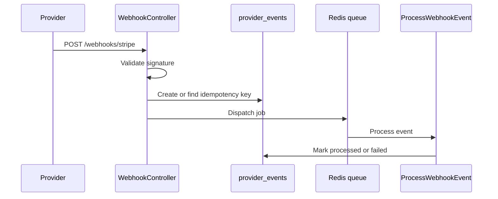

# Operations

## Runtime services

LedgerFlow expects:

- PostgreSQL 17 for all persistent application state.
- Redis 7 for cache and queues.
- Laravel Horizon for queue visibility.
- Laravel Pulse and Telescope for local/non-production observability.

## Webhook operations

Payment provider webhooks enter through `POST /webhooks/{provider}`. The ingestion path stores each incoming event, deduplicates by provider event identity, and dispatches processing to the queue.

Operational checks:

- Failed webhook jobs should be inspected in Horizon.
- Duplicate provider deliveries should return successfully without reprocessing.
- Provider-specific signature validation should be tested before enabling a new provider.

## Queue operations

Queues are used for webhook processing and future reconciliation/AI background work. In development, `composer run dev` starts a queue listener. In production, Horizon should supervise workers.

## CI pipeline

Source changes run through `.github/workflows/on_source_change.yml`:

1. Pint style check.
2. PHPStan static analysis.
3. Asset build, migrations, and Pest tests against PostgreSQL and Redis.
4. Semantic release on `main` and `release/*` only after the quality gates pass.

Documentation changes run through `.github/workflows/on_docs_change.yml`, which generates TechDocs from `docs/techdocs` and deploys the published site from `main`.

## Release operations

Releases are commit-driven:

- `feat:` and `feature:` produce minor releases.
- `fix:`, `bugfix:`, and `hotfix:` produce patch releases.
- `BREAKING CHANGE` notes produce major releases.
- `release/*` branches produce `rc` prereleases.
- `main` produces stable tags, GitHub Releases, and `CHANGELOG.md` updates.

The release commit is intentionally `chore(release): <version>` so it does not trigger another release.
